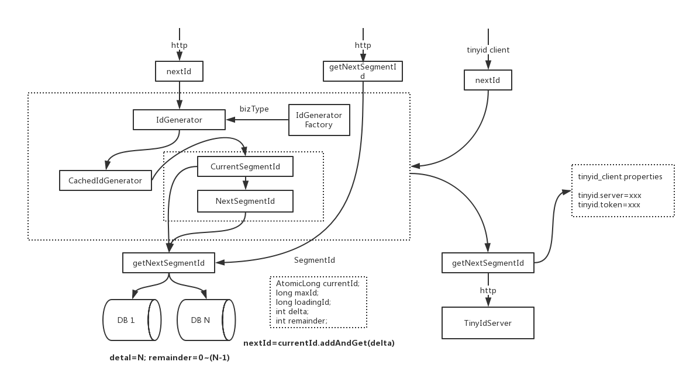
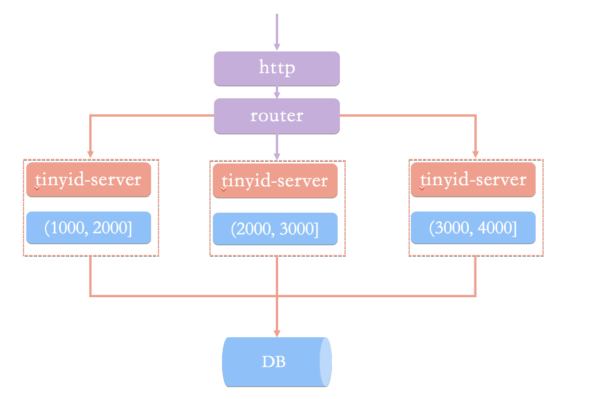
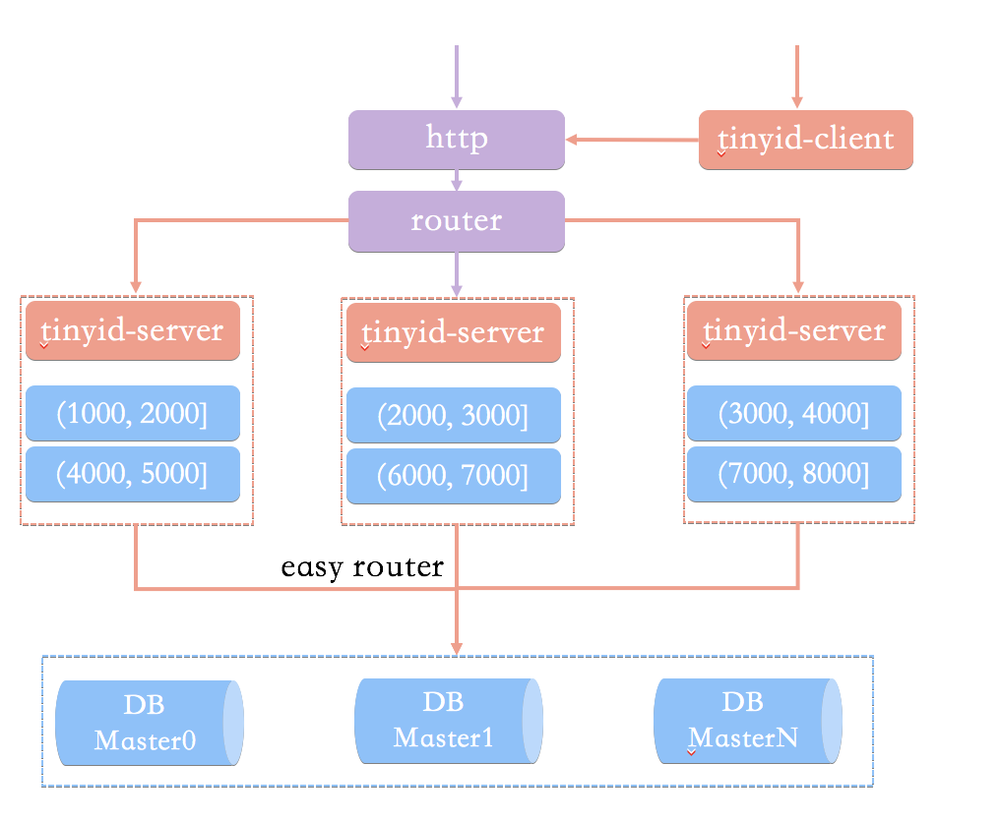

## 简介

Tinyid是用Java开发的一款分布式id生成系统，基于数据库号段算法实现，关于这个算法可以参考[美团leaf](https://tech.meituan.com/MT_Leaf.html)或者[tinyid原理介绍](https://github.com/didi/tinyid/wiki/tinyid%E5%8E%9F%E7%90%86%E4%BB%8B%E7%BB%8D)。Tinyid扩展了leaf-segment算法，支持了多db(master)，同时提供了java-client(sdk)使id生成本地化，获得了更好的性能与可用性。Tinyid在滴滴客服部门使用，均通过tinyid-client方式接入，每天生成亿级别的id。

## 性能与可用性

### 性能

1. http方式访问，性能取决于http server的能力，网络传输速度
1. java-client方式，id为本地生成，号段长度(step)越长，qps越大，如果将号段设置足够大，则qps可达1000w+

### 可用性

1. 依赖db，当db不可用时，因为server有缓存，所以还可以使用一段时间，如果配置了多个db，则只要有1个db存活，则服务可用
1. 使用tiny-client，只要server有一台存活，则理论上可用，server全挂，因为client有缓存，也可以继续使用一段时间

## Tinyid的特性

1. 全局唯一的long型id
1. 趋势递增的id，即不保证下一个id一定比上一个大
1. 非连续性
1. 提供http和java client方式接入
1. 支持批量获取id
1. 支持生成1,3,5,7,9...序列的id
1. 支持多个db的配置，无单点

适用场景:只关心id是数字，趋势递增的系统，可以容忍id不连续，有浪费的场景   
不适用场景:类似订单id的业务(因为生成的id大部分是连续的，容易被扫库、或者测算出订单量)

## 依赖

JDK1.7+,maven,mysql, java client目前仅依赖jdk

## 示例

请参考getting start

## 推荐使用方式

* tinyid-server推荐部署到多个机房的多台机器
    * 多机房部署可用性更高，http方式访问需使用方考虑延迟问题
* 推荐使用tinyid-client来获取id，好处如下:
    * id为本地生成(调用AtomicLong.addAndGet方法)，性能大大增加
    * client对server访问变的低频，减轻了server的压力
    * 因为低频，即便client使用方和server不在一个机房，也无须担心延迟
    * 即便所有server挂掉，因为client预加载了号段，依然可以继续使用一段时间
      注:使用tinyid-client方式，如果client机器较多频繁重启，可能会浪费较多的id，这时可以考虑使用http方式
* 推荐db配置两个或更多:
    * db配置多个时，只要有1个db存活，则服务可用 [多db配置](https://github.com/didi/tinyid/wiki/Tinyid-server-config#%E5%A4%9Adb%E9%85%8D%E7%BD%AE)，如配置了两个db，则每次新增业务需在两个db中都写入相关数据

## tinyid的原理

* tinyid是基于数据库发号算法实现的，简单来说是数据库中保存了可用的id号段，tinyid会将可用号段加载到内存中，之后生成id会直接内存中产生。
* 可用号段在第一次获取id时加载，如当前号段使用达到一定量时，会异步加载下一可用号段，保证内存中始终有可用号段。
* (如可用号段1\~1000被加载到内存，则获取id时，会从1开始递增获取，当使用到一定百分比时，如20%(默认)，即200时，会异步加载下一可用号段到内存，假设新加载的号段是1001\~2000,则此时内存中可用号段为200\~1000,1001\~2000)，当id递增到1000时，当前号段使用完毕，下一号段会替换为当前号段。依次类推。

## tinyid系统架构图



下面是一些关于这个架构图的说明:

* nextId和getNextSegmentId是tinyid-server对外提供的两个http接口
* nextId是获取下一个id，当调用nextId时，会传入bizType，每个bizType的id数据是隔离的，生成id会使用该bizType类型生成的IdGenerator。
* getNextSegmentId是获取下一个可用号段，tinyid-client会通过此接口来获取可用号段
* IdGenerator是id生成的接口
* IdGeneratorFactory是生产具体IdGenerator的工厂，每个biz_type生成一个IdGenerator实例。通过工厂，我们可以随时在db中新增biz_type，而不用重启服务
* IdGeneratorFactory实际上有两个子类IdGeneratorFactoryServer和IdGeneratorFactoryClient，区别在于，getNextSegmentId的不同，一个是DbGet,一个是HttpGet
* CachedIdGenerator则是具体的id生成器对象，持有currentSegmentId和nextSegmentId对象，负责nextId的核心流程。nextId最终通过AtomicLong.andAndGet(delta)方法产生。

## 其他说明

* 关于tinyid，并不是滴滴官方产品，只是滴滴拥有的代码。
* 其他id生成项目推荐
    * [twitter snowflake](https://github.com/twitter-archive/snowflake)
    * [百度uid-generator](https://github.com/baidu/uid-generator): 这是基于snowflake方案实现的开源组件，借用未来时间、缓存等手段，qps可达600w+
    * [美团leaf](https://tech.meituan.com/MT_Leaf.html): 该篇文章详细的介绍了db号段和snowflake方案，近期也进行了[Leaf开源]


# Getting started

## 简介

tinyid是具有中心server的，需要先部署tinyid-server才能使用

## 建表

cd tinyid/tinyid-server/ && create table with db.sql (mysql)

## 配置数据库

cd tinyid-server/src/main/resources/offline && vi application.properties

```properties
datasource.tinyid.names=primary

datasource.tinyid.primary.driver-class-name=com.mysql.jdbc.Driver
datasource.tinyid.primary.url=jdbc:mysql://ip:port/databaseName?autoReconnect=true&useUnicode=true&characterEncoding=UTF-8
datasource.tinyid.primary.username=root
datasource.tinyid.primary.password=123456
```

## 启动 tinyid-server

```xml
cd tinyid-server/ 
sh build.sh offline
java -jar output/tinyid-server-xxx.jar
```

## REST API

```properties
nextId:
curl 'http://localhost:9999/tinyid/id/nextId?bizType=test&token=0f673adf80504e2eaa552f5d791b644c'
response:{"data":[2],"code":200,"message":""}

nextId Simple:
curl 'http://localhost:9999/tinyid/id/nextIdSimple?bizType=test&token=0f673adf80504e2eaa552f5d791b644c'
response: 3

with batchSize:
curl 'http://localhost:9999/tinyid/id/nextIdSimple?bizType=test&token=0f673adf80504e2eaa552f5d791b644c&batchSize=10'
response: 4,5,6,7,8,9,10,11,12,13

Get nextId like 1,3,5,7,9...
bizType=test_odd : delta is 2 and remainder is 1
curl 'http://localhost:9999/tinyid/id/nextIdSimple?bizType=test_odd&batchSize=10&token=0f673adf80504e2eaa552f5d791b644c'
response: 3,5,7,9,11,13,15,17,19,21
```

## Java client 推荐使用

### Maven dependency

```xml
<dependency>
    <groupId>com.xiaoju.uemc.tinyid</groupId>
    <artifactId>tinyid-client</artifactId>
    <version>${tinyid.version}</version>
</dependency>
```

### classpath中创建tinyid_client.properties

tinyid_client.properties:

```properties
tinyid.server=localhost:9999
tinyid.token=0f673adf80504e2eaa552f5d791b644c

#(tinyid.server=localhost:9999/gateway,ip2:port2/prefix,...)
```

### Java Code

```java
Long id = TinyId.nextId("test");
List<Long> ids = TinyId.nextId("test", 10);
```

# Tinyid client config

## tinyid_client.properties

必须的配置如下:

```properties
tinyid.server=localhost:9999
tinyid.token=0f673adf80504e2eaa552f5d791b644c
```

多server的配置用","分隔，server部署后如果带后缀，可配置在后端后，如下:

```properties
tinyid.server=localhost:9999/gateway,ip2:port2/prefix
# 如下两个是连接server的两个可选参数，单位是毫秒，默认是5000
tinyid.readTimeout=3000
tinyid.connectTimeout=3000
```

# Tinyid-server-config

## 单db配置

```properties
datasource.tinyid.names=primary

datasource.tinyid.primary.driver-class-name=com.mysql.jdbc.Driver
datasource.tinyid.primary.url=jdbc:mysql://ip:port/databaseName?autoReconnect=true&useUnicode=true&characterEncoding=UTF-8
datasource.tinyid.primary.username=root
datasource.tinyid.primary.password=123456
```

单db时，delta=1，remainder=0即可

## 多db配置

以两个db配置为例，配置文件如下:

```properties
datasource.tinyid.names=primary,secondary

datasource.tinyid.primary.driver-class-name=com.mysql.jdbc.Driver
datasource.tinyid.primary.url=jdbc:mysql://localhost:3306/db1?autoReconnect=true&useUnicode=true&characterEncoding=UTF-8
datasource.tinyid.primary.username=root
datasource.tinyid.primary.password=123456
datasource.tinyid.primary.testOnBorrow=false
datasource.tinyid.primary.maxActive=10

datasource.tinyid.secondary.driver-class-name=com.mysql.jdbc.Driver
datasource.tinyid.secondary.url=jdbc:mysql://localhost:3306/db2?autoReconnect=true&useUnicode=true&characterEncoding=UTF-8
datasource.tinyid.secondary.username=root
datasource.tinyid.secondary.password=123456
datasource.tinyid.secondary.testOnBorrow=false
datasource.tinyid.secondary.maxActive=10
```

如上两个db，如果要生成1,2,3,4....序列的数据，则db中的数据设置如下:

| biz_type | delta | remainder | 备注                     |
| -------- | ----- | --------- | ------------------------ |
| test     | 2     | 0         | 生成2,4,6,8序列的数据... |

| biz_type | delta | remainder | 备注                     |
| -------- | ----- | --------- | ------------------------ |
| test     | 2     | 1         | 生成1,3,5,7序列的数据... |

* 如果primary db挂掉(remainder=0)，则仍能正常服务，但只能产生1,3,5,7..的序列
* 注:不用介意max_id的初始值是奇数还是偶数，都能生成正确的序列

如上两个db，如果要生成1,3,5,7....序列的数据，则db中的数据设置如下:

| biz_type | delta | remainder | 备注                      |
| -------- | ----- | --------- | ------------------------- |
| test     | 4     | 1         | 生成1,5,9,13序列的数据... |

| biz_type | delta | remainder | 备注                       |
| -------- | ----- | --------- | -------------------------- |
| test     | 4     | 3         | 生成3,7,11,15序列的数据... |


# Tinyid原理介绍

## Id生成系统要点

&emsp;在简单系统中，我们常常使用db的id自增方式来标识和保存数据，随着系统的复杂，数据的增多，分库分表成为了常见的方案，db自增已无法满足要求。这时候全局唯一的id生成系统就派上了用场。当然这只是id生成其中的一种应用场景。那么id生成系统有哪些要求呢？

1. 全局唯一的id:无论怎样都不能重复，这是最基本的要求了
1. 高性能:基础服务尽可能耗时少，如果能够本地生成最好
1. 高可用:虽说很难实现100%的可用性，但是也要无限接近于100%的可用性
1. 简单易用: 能够拿来即用，接入方便，同时在系统设计和实现上要尽可能的简单

## Tinyid的实现原理

&emsp;我们先来看一下最常见的id生成方式，db的auto_increment，相信大家都非常熟悉，我也见过一些同学在实战中使用这种方案来获取一个id，这个方案的优点是简单，缺点是每次只能向db获取一个id，性能比较差，对db访问比较频繁，db的压力会比较大。那么是不是可以对这种方案优化一下呢，可否一次向db获取一批id呢？答案当然是可以的。  
&emsp;一批id，我们可以看成是一个id范围，例如(1000,2000]，这个1000到2000也可以称为一个"号段"，我们一次向db申请一个号段，加载到内存中，然后采用自增的方式来生成id，这个号段用完后，再次向db申请一个新的号段，这样对db的压力就减轻了很多，同时内存中直接生成id，性能则提高了很多。那么保存db号段的表该怎设计呢？

### DB号段算法描述

| id   | start_id | end_id |
| ---- | -------- | ------ |
| 1    | 1000     | 2000   |

&emsp;如上表，我们很容易想到的是db直接存储一个范围(start_id,end_id]，当这批id使用完毕后，我们做一次update操作，update start_id=2000(end_id), end_id=3000(end_id+1000)，update成功了，则说明获取到了下一个id范围。仔细想想，实际上start_id并没有起什么作用，新的号段总是(end_id,end_id+1000]。所以这里我们更改一下，db设计应该是这样的

| id   | biz_type | max_id | step | version |
| ---- | -------- | ------ | ---- | ------- |
| 1    | 1000     | 2000   | 1000 | 0       |

* 这里我们增加了biz_type，这个代表业务类型，不同的业务的id隔离
* max_id则是上面的end_id了，代表当前最大的可用id
* step代表号段的长度，可以根据每个业务的qps来设置一个合理的长度
* version是一个乐观锁，每次更新都加上version，能够保证并发更新的正确性

&emsp;那么我们可以通过如下几个步骤来获取一个可用的号段，

* A.查询当前的max_id信息：select id, biz_type, max_id, step, version from tiny_id_info where biz_type='test';
* B.计算新的max_id: new_max_id = max_id + step
* C.更新DB中的max_id：update tiny_id_info set max_id=#{new_max_id} , verison=version+1 where id=#{id} and max_id=#{max_id} and version=#{version}
* D.如果更新成功，则可用号段获取成功，新的可用号段为(max_id, new_max_id]
* E.如果更新失败，则号段可能被其他线程获取，回到步骤A，进行重试

### 号段生成方案的简单架构

&emsp;如上我们已经完成了号段生成逻辑，那么我们的id生成服务架构可能是这样的



&emsp;id生成系统向外提供http服务，请求经过我们的负载均衡router，到达其中一台tinyid-server，从事先加载好的号段中获取一个id，如果号段还没有加载，或者已经用完，则向db再申请一个新的可用号段，多台server之间因为号段生成算法的原子性，而保证每台server上的可用号段不重，从而使id生成不重。  
&emsp;可以看到如果tinyid-server如果重启了，那么号段就作废了，会浪费一部分id；同时id也不会连续；每次请求可能会打到不同的机器上，id也不是单调递增的，而是趋势递增的，不过这对于大部分业务都是可接受的。

### 简单架构的问题

&emsp;到此一个简单的id生成系统就完成了，那么是否还存在问题呢？回想一下我们最开始的id生成系统要求，高性能、高可用、简单易用，在上面这套架构里，至少还存在以下问题:

* 当id用完时需要访问db加载新的号段，db更新也可能存在version冲突，此时id生成耗时明显增加
* db是一个单点，虽然db可以建设主从等高可用架构，但始终是一个单点
* 使用http方式获取一个id，存在网络开销，性能和可用性都不太好

### 优化办法

#### 双号段缓存

&emsp;对于号段用完需要访问db，我们很容易想到在号段用到一定程度的时候，就去异步加载下一个号段，保证内存中始终有可用号段，则可避免性能波动。

#### 增加多db支持

&emsp;db只有一个master时，如果db不可用(down掉或者主从延迟比较大)，则获取号段不可用。实际上我们可以支持多个db，比如2个db，A和B，我们获取号段可以随机从其中一台上获取。那么如果A,B都获取到了同一号段，我们怎么保证生成的id不重呢？tinyid是这么做的，让A只生成偶数id，B只生产奇数id，对应的db设计增加了两个字段，如下所示

| id   | biz_type | max_id | step | delta | remainder | version |
| ---- | -------- | ------ | ---- | ----- | --------- | ------- |
| 1    | 1000     | 2000   | 1000 | 2     | 0         | 0       |

&emsp;delta代表id每次的增量，remainder代表余数，例如可以将A，B都delta都设置2，remainder分别设置为0，1则，A的号段只生成偶数号段，B是奇数号段。 通过delta和remainder两个字段我们可以根据使用方的需求灵活设计db个数，同时也可以为使用方提供只生产类似奇数的id序列。

#### 增加tinyid-client

&emsp;使用http获取一个id，存在网络开销，是否可以本地生成id？为此我们提供了tinyid-client，我们可以向tinyid-server发送请求来获取可用号段，之后在本地构建双号段、id生成，如此id生成则变成纯本地操作，性能大大提升，因为本地有双号段缓存，则可以容忍tinyid-server一段时间的down掉，可用性也有了比较大的提升。

#### tinyid最终架构

&emsp;最终我们的架构可能是这样的



* tinyid提供http和tinyid-client两种方式接入
* tinyid-server内部缓存两个号段
* 号段基于db生成，具有原子性
* db支持多个
* tinyid-server内置easy-router选择db

## 总结

&emsp;好了，到此为止，tinyid的整体架构已经介绍完了。如果你感兴趣，可以看一下tinyid的相关代码，所有code都非常简单。Have fun!

## 其他说明

关于号段算法实现，tinyid参考了[美团leaf](https://tech.meituan.com/MT_Leaf.html)，并对其做了扩展，增加了多db支持和tinyid-client，从而获得了更好的性能和可用性。